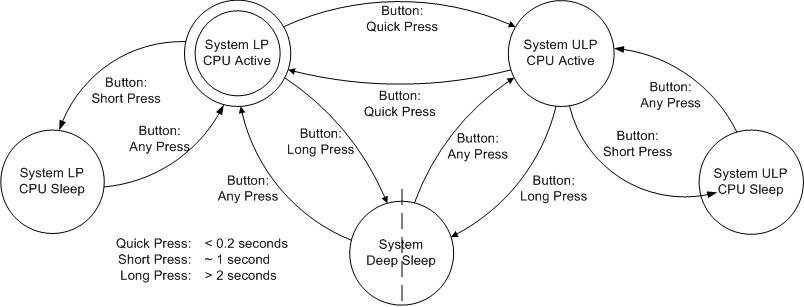
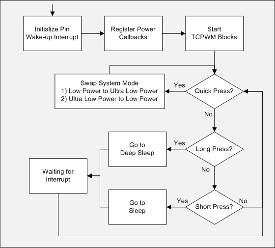

# PSoC 6 MCU Switching between Power Modes

This example demonstrates how to transition PSoC® 6 MCU to the following power modes - Low Power Active, Low Power Sleep, Ultra Low Power Active, Ultra Low Power Sleep, and Deep Sleep.

## Overview

This code example shows how to enter system Low Power (LP) and Ultra Low Power (ULP) modes, and transition to CPU Sleep or Deep Sleep mode. The system modes affect the whole device, and the CPU modes affect only one CPU. After transitioning to Deep Sleep or Sleep mode, the example also shows how to wake up and return to LP or ULP mode. This example does not cover Hibernate Mode. For more information on this mode, see the PSoC 6 documentation. [AN219528 - PSoC 6 MCU Low-Power Modes and Power Reduction Techniques](http://www.cypress.com/an219528) provides additional details on the PSoC 6 MCU power modes, use of the SysPM driver, and other recommendations for reducing power consumption.

The project uses a kit button to change power mode. [Figure 1](#figure-1-power-mode-state-machine) shows the state machine implemented in the firmware to execute the transitions.

Figure 1. Power Mode State Machine



The project also uses one LED to indicate the power mode selected. [Table 1](#table-1-LED-State-in-various-power-modes) shows the state of the LED for each mode.

Table 1. LED State in various Power Modes

| **System/Power Mode** | **LED State** |
|-------------------------|---------------|
| System LP/CPU Active | Blinks quickly |
| System LP/CPU Sleep | Turned ON and bright |
| System ULP/CPU Active | Blinks slowly |
| System ULP/CPU Sleep | Turned ON and dimmed |
| System/Deep Sleep | Turned OFF |


## Requirements

- [ModusToolbox IDE](https://www.cypress.com/ModusToolbox) v2.0  
- Programming Language: C  
- Associated Parts: All PSoC 6 MCU [parts](https://www.cypress.com/PSoC6)

## Supported Kits

- [PSoC 6 Wi-Fi BT Prototyping Kit](https://www.cypress.com/CY8CPROTO-062-4343W)

## Hardware Setup

The example does not require any additional hardware to run. However, you can connect an ammeter to measure the current consumed by the PSoC MCU device. If using any of the PSoC 6 MCU Pioneer kits, remove the jumper PWR_MON from the kit and connect the ammeter on the header pins. This jumper is at the bottom side of the PSoC 6 MCU Pioneer kits. See the kit guide for the exact location. If using any of the Proto Board kits, see the kit guide how to measure the current. It might require changes in the hardware.

## Software Setup

This example requires no additional software or tools.

## Using the Code Example

#### In the ModusToolbox IDE

1. Click the **New Application** link in the Quick Panel (or, use **File > New > ModusToolbox IDE Application**).

2. Pick a kit supported by the code example from the list shown in the **IDE Application** dialog. When you select a supported kit the example is reconfigured automatically to work with the kit.

3. In the **Starter Application** window, choose the example.

4. Click **Next** and complete the application creation process.

 If you are unfamiliar with this process, see [KBA225201](https://community.cypress.com/docs/DOC-15968) for all the details.

#### In Command-line Interface (CLI)

1. Download and unzip this repository onto your local machine, or clone the repository.
2. Open a CLI terminal and navigate to the application folder.
3. Import required libraries by executing the command `make getlibs`.

## Operation

1. Connect the board to your PC using the provided USB cable through the USB connector.

2. Program the board.

   #### Using ModusToolbox IDE

   1. Select the application project in the Project Explorer.
   2. In the **Quick Panel**, scroll down, and click **\<Application Name> Program (KitProg3)**.

   #### Using CLI

   1. From the terminal, execute the command `make program` to build and program the application using the default toolchain to the default target. You can specify a target and toolchain manually:
        ```
        make program TARGET=<BSP> TOOLCHAIN=<toolchain>
        ```
        Example:

        ```
        make program TARGET=CY8CKIT-062-WiFi-BT TOOLCHAIN=GCC_ARM
        ```
        **Note**:  Before building the application, ensure the *libs* folder contains the BSP (*.lib*) file corresponding to the TARGET. Execute `make getlibs` to fetch the BSP contents before building the application.

3. After programming, the application starts automatically. Confirm that kit LED blinks at 5 Hz (approximately). Take note of the current consumption. The device is in System LP and CPU Active modes at this moment.

4. Press the kit button for approximately one second and release it. Observe that the LED is ON and fully bright. Confirm that the current consumption drops a few hundreds of microamperes. The device is in System LP and CPU Sleep modes at this moment.

5. Quickly press the kit button to return to System LP and CPU Active modes. Observe that the LED blinks quickly again.

6. Press the kit button for at least two seconds and release it. Observe that the LED is OFF and that the current consumption has dropped to a few microamperes. The device is in System Deep Sleep mode at this moment.

7. Quickly press the kit button to return to System LP mode. Observe that the LED blinks quickly and that the current consumption has increased to the same level measured before.

8. Quickly press the kit button again to enter System ULP mode. Observe that the LED blinks slowly and that the current consumption has dropped significantly when compared to System LP mode. You can quickly press the kit button to switch between the two modes.

9. Keep the device in System ULP mode and press the kit button for approximately one second and release it. Observe that the LED dims and that the current consumption has dropped a few hundred microamperes. The device is in the System ULP and CPU Sleep modes at this moment.

10. Quickly press the kit button to return to the System ULP and CPU Active modes. Observe that the is blinking slowly again.

11. Press the kit button for at least two seconds and release it. Observe that the LED is OFF and that the current consumption has dropped to a few microamperes. The device is in System Deep Sleep mode at this moment.

12. Quickly press the user button and return to the System ULP and CPU Active modes. Observe that the LED blinks slowly again and that the current consumption has increased to the same level measured before.

### Debugging

You can debug the example to step through the code. In the ModusToolbox IDE, use the **\<Application Name> Debug (KitProg3)** configuration in the **Quick Panel**. If you are unfamiliar with how to start a debug session with ModusToolbox IDE, see [KBA224621](https://community.cypress.com/docs/DOC-15763).

## Design and Implementation

This example configures the TCPWM resource in PWM mode to blink, dim and turn ON/OFF the LED. The firmware implements the state machine shown in the Overview section and controls the duty cycle of the PWM block. The device wakes up when a switch press is detected. [Figure 2](#figure-2-cm4-cpu-flowchart) shows the firmware flow of CM4 CPU.

Figure 2. CM4 CPU Flowchart



Six power callback functions are registered. [Table 2](#table-2-state-modes-(cy_SYSPM_*)) shows the actions of each callback function. For more information on power callbacks, see the PDL Driver - System Power Management (SysPm).

Table 2. State Modes (CY_SYSPM_*) 


| | CHECK_READY | CHECK_FAIL | BEFORE_TRANSITION | AFTER_TRANSITION |
|---| ---| --- | --- | --- |
| PWM Sleep Callback | Nothing | Nothing | If in System ULP Mode, dim the LED. If in System LP Mode, turn ON the LED. | If in System ULP Mode, blink the LED slowly. If in System LP, blink the LED fast. |
| PWM Deep Sleep Callback | Nothing | Nothing | Stop PWM. | Re-enable the PWM block. If in System ULP mode, blink the LED slowly. If in System LP Mode, blink the LED fast. |
| PWM Enter ULP Callback | Nothing | Nothing | Nothing | Blink the LED slowly. |
| PWM Enter LP Callback | Nothing | Nothing | Nothing | Blink the LED fast. |
| Clock Enter System ULP Callback | Nothing | Nothing | Reconfigure the System Clock to 50 MHz. | Nothing |
| Clock Exit System ULP Callback | Nothing | Nothing | Nothing | Reconfigure the System Clock to 100 MHz. |

## Related Resources

| Application Notes                                            |                                                              |
| :----------------------------------------------------------- | :----------------------------------------------------------- |
| [AN228571](https://www.cypress.com/AN228571) - Getting Started with PSoC 6 MCU on ModusToolbox | Describes PSoC 6 MCU devices and how to build your first application with ModusToolbox |
| [AN221774](https://www.cypress.com/AN221774) - Getting Started with PSoC 6 MCU on PSoC Creator | Describes PSoC 6 MCU devices and how to build your first application with PSoC Creator |
| [AN210781](https://www.cypress.com/AN210781) - Getting Started with PSoC 6 MCU with Bluetooth Low Energy (BLE) Connectivity on PSoC Creator | Describes PSoC 6 MCU with BLE Connectivity devices and how to build your first application with PSoC Creator |
| [AN215656](https://www.cypress.com/AN215656) - PSoC 6 MCU: Dual-CPU System Design | Describes the dual-CPU architecture in PSoC 6 MCU, and shows how to build a simple dual-CPU design |
| [AN219528](https://www.cypress.com/an219528) - PSoC 6 MCU: Low-Power Modes and Power Reduction Techniques | Describes the PSoC 6 power modes to optimize power consumption |
| **Code Examples**                                            |                                                              |
| [Using ModusToolbox IDE](https://github.com/cypresssemiconductorco/Code-Examples-for-ModusToolbox-Software) | [Using PSoC Creator](https://www.cypress.com/documentation/code-examples/psoc-6-mcu-code-examples) |
| **Device Documentation**                                     |                                                              |
| [PSoC 6 MCU Datasheets](https://www.cypress.com/search/all?f[0]=meta_type%3Atechnical_documents&f[1]=resource_meta_type%3A575&f[2]=field_related_products%3A114026) | [PSoC 6 Technical Reference Manuals](https://www.cypress.com/search/all/PSoC%206%20Technical%20Reference%20Manual?f[0]=meta_type%3Atechnical_documents&f[1]=resource_meta_type%3A583) |
| **Development Kits**                                         | Available at Cypress.com                                     |
| [CY8CKIT-062-BLE](https://www.cypress.com/CY8CKIT-062-BLE) PSoC 6 BLE Pioneer Kit | [CY8CKIT-062-WiFi-BT](https://www.cypress.com/CY8CKIT-062-WiFi-BT) PSoC 6 WiFi-BT Pioneer Kit |
| [CY8CPROTO-063-BLE](https://www.cypress.com/CY8CPROTO-063-BLE) PSoC 6 BLE Prototyping Kit | [CY8CPROTO-062-4343W](https://www.cypress.com/cy8cproto-062-4343w) PSoC 6 Wi-Fi BT Prototyping Kit |
| **Middleware**                                               | Middleware libraries are distributed on GitHub               |
| PSoC 6 Peripheral Driver Library and docs                    | [psoc6pdl](https://github.com/cypresssemiconductorco/psoc6pdl) on GitHub |
| Links to all PSoC 6 Middleware                               | [psoc6-middleware](https://github.com/cypresssemiconductorco/psoc6-middleware) on GitHub |
| **Tools**                                                    |                                                              |
| [ModusToolbox IDE](https://www.cypress.com/modustoolbox)     | The Cypress IDE for PSoC 6 and IoT designers                 |
| [PSoC Creator](https://www.cypress.com/products/psoc-creator-integrated-design-environment-ide) | The Cypress IDE for PSoC and FM0+ development                |

### Other Resources

Cypress provides a wealth of data at www.cypress.com to help you to select the right device, and quickly and effectively integrate the device into your design.

For the PSoC 6 MCU devices, see [KBA223067](https://community.cypress.com/docs/DOC-14644) in the Cypress community for a comprehensive list of PSoC 6 MCU resources.

------

All other trademarks or registered trademarks referenced herein are the property of their respective
owners.


-------------------------------------------------------------------------------

© Cypress Semiconductor Corporation, 2019. This document is the property of Cypress Semiconductor Corporation and its subsidiaries ("Cypress"). This document, including any software or firmware included or referenced in this document ("Software"), is owned by Cypress under the intellectual property laws and treaties of the United States and other countries worldwide. Cypress reserves all rights under such laws and treaties and does not, except as specifically stated in this paragraph, grant any license under its patents, copyrights, trademarks, or other intellectual property rights. If the Software is not accompanied by a license agreement and you do not otherwise have a written agreement with Cypress governing the use of the Software, then Cypress hereby grants you a personal, non-exclusive, nontransferable license (without the right to sublicense) (1) under its copyright rights in the Software (a) for Software provided in source code form, to modify and reproduce the Software solely for use with Cypress hardware products, only internally within your organization, and (b) to distribute the Software in binary code form externally to end users (either directly or indirectly through resellers and distributors), solely for use on Cypress hardware product units, and (2) under those claims of Cypress's patents that are infringed by the Software (as provided by Cypress, unmodified) to make, use, distribute, and import the Software solely for use with Cypress hardware products. Any other use, reproduction, modification, translation, or compilation of the Software is prohibited.  
TO THE EXTENT PERMITTED BY APPLICABLE LAW, CYPRESS MAKES NO WARRANTY OF ANY KIND, EXPRESS OR IMPLIED, WITH REGARD TO THIS DOCUMENT OR ANY SOFTWARE OR ACCOMPANYING HARDWARE, INCLUDING, BUT NOT LIMITED TO, THE IMPLIED WARRANTIES OF MERCHANTABILITY AND FITNESS FOR A PARTICULAR PURPOSE. No computing device can be absolutely secure. Therefore, despite security measures implemented in Cypress hardware or software products, Cypress shall have no liability arising out of any security breach, such as unauthorized access to or use of a Cypress product. CYPRESS DOES NOT REPRESENT, WARRANT, OR GUARANTEE THAT CYPRESS PRODUCTS, OR SYSTEMS CREATED USING CYPRESS PRODUCTS, WILL BE FREE FROM CORRUPTION, ATTACK, VIRUSES, INTERFERENCE, HACKING, DATA LOSS OR THEFT, OR OTHER SECURITY INTRUSION (collectively, "Security Breach"). Cypress disclaims any liability relating to any Security Breach, and you shall and hereby do release Cypress from any claim, damage, or other liability arising from any Security Breach. In addition, the products described in these materials may contain design defects or errors known as errata which may cause the product to deviate from published specifications. To the extent permitted by applicable law, Cypress reserves the right to make changes to this document without further notice. Cypress does not assume any liability arising out of the application or use of any product or circuit described in this document. Any information provided in this document, including any sample design information or programming code, is provided only for reference purposes. It is the responsibility of the user of this document to properly design, program, and test the functionality and safety of any application made of this information and any resulting product. "High-Risk Device" means any device or system whose failure could cause personal injury, death, or property damage. Examples of High-Risk Devices are weapons, nuclear installations, surgical implants, and other medical devices. "Critical Component" means any component of a High-Risk Device whose failure to perform can be reasonably expected to cause, directly or indirectly, the failure of the High-Risk Device, or to affect its safety or effectiveness. Cypress is not liable, in whole or in part, and you shall and hereby do release Cypress from any claim, damage, or other liability arising from any use of a Cypress product as a Critical Component in a High-Risk Device. You shall indemnify and hold Cypress, its directors, officers, employees, agents, affiliates, distributors, and assigns harmless from and against all claims, costs, damages, and expenses, arising out of any claim, including claims for product liability, personal injury or death, or property damage arising from any use of a Cypress product as a Critical Component in a High-Risk Device. Cypress products are not intended or authorized for use as a Critical Component in any High-Risk Device except to the limited extent that (i) Cypress's published data sheet for the product explicitly states Cypress has qualified the product for use in a specific High-Risk Device, or (ii) Cypress has given you advance written authorization to use the product as a Critical Component in the specific High-Risk Device and you have signed a separate indemnification agreement.  
Cypress, the Cypress logo, Spansion, the Spansion logo, and combinations thereof, WICED, PSoC, CapSense, EZ-USB, F-RAM, and Traveo are trademarks or registered trademarks of Cypress in the United States and other countries. For a more complete list of Cypress trademarks, visit cypress.com. Other names and brands may be claimed as property of their respective owners.
